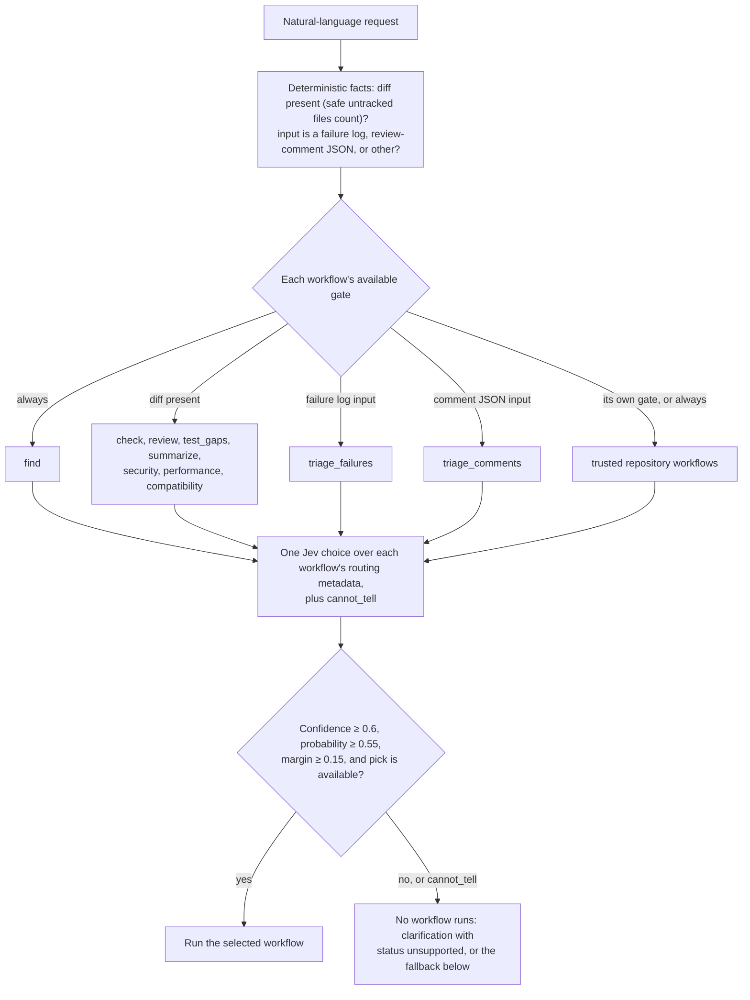
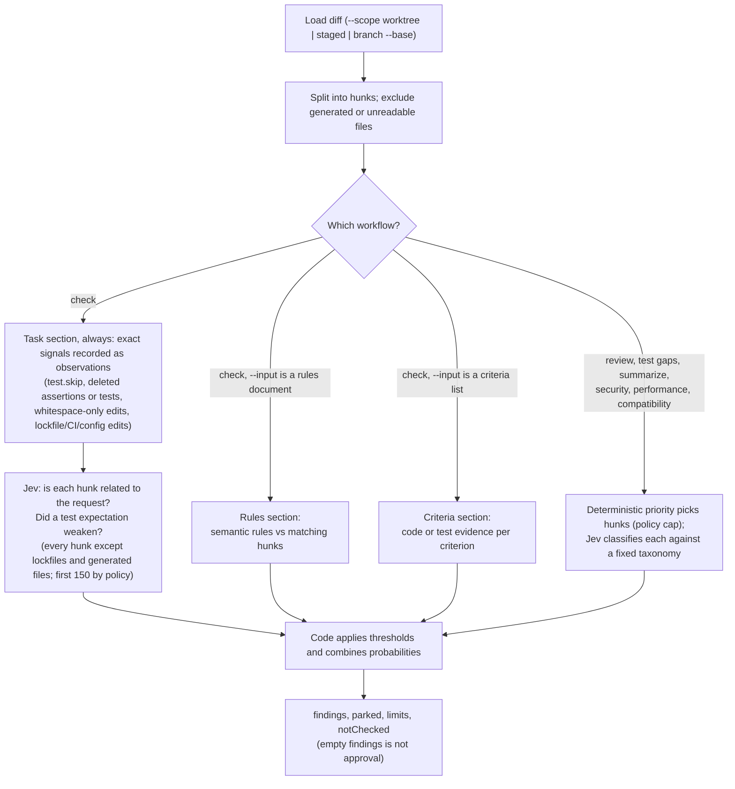
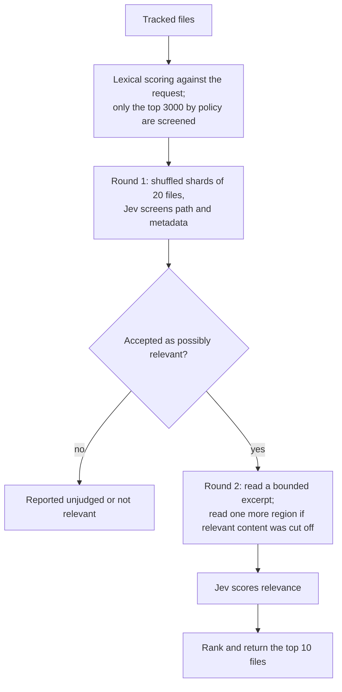
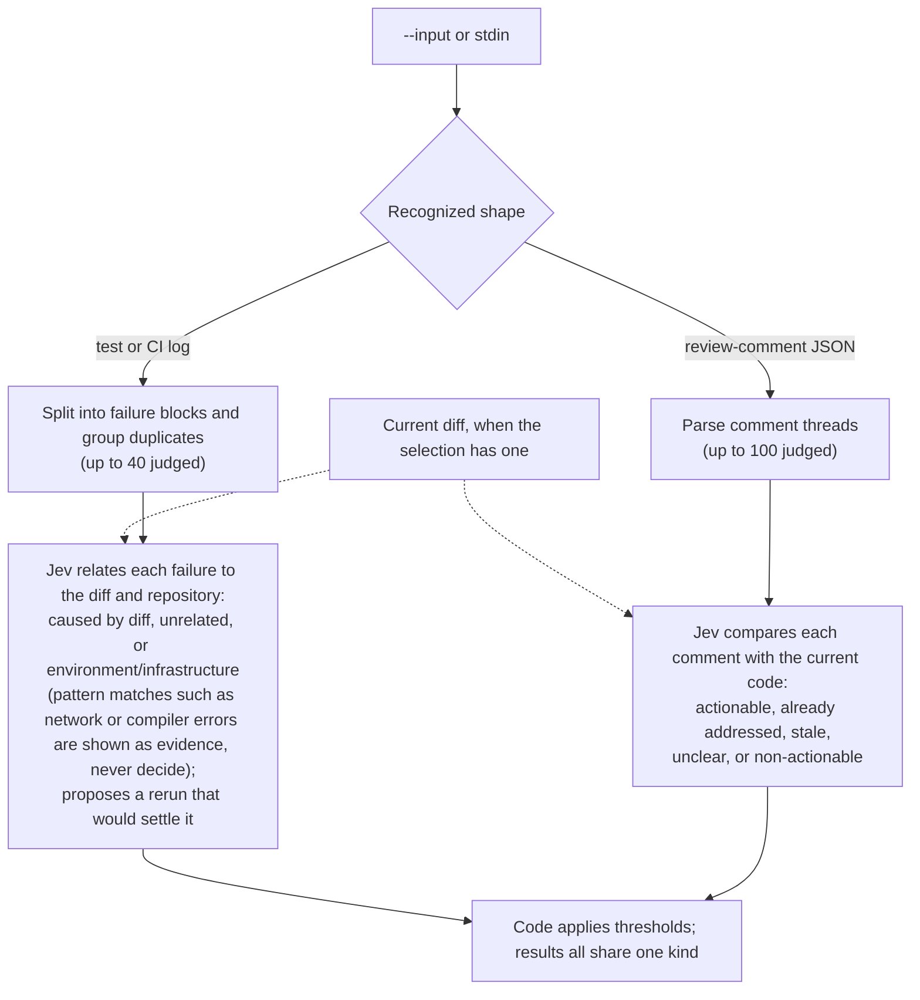

# Stanley

**A Jev-first, self-improving coding agent.**

Stanley is a command-line tool for checking and understanding code changes. Instead of naming a command,
you describe what you need. [TypeSafe Jev](https://typesafe.ai) routes the request to one workflow: a built-in,
a trusted repository workflow, or one Stanley wrote for itself. Each workflow is deterministic code that
gathers bounded evidence and asks Jev small fixed-choice questions about it; code, not a model, makes the
decisions. That is the hot path, and it never starts a general agent.

When no workflow supports a request, Stanley falls back to the [Pi](https://www.npmjs.com/package/@earendil-works/pi-coding-agent)
coding agent if it is installed, reports the agent's own account of what it did without claiming to have verified
it, and then, in the background, asks an agent to write a Stanley workflow for that kind of request. The
candidate is validated and staged; you promote it, and the next such request runs without any agent.

Stanley was previously published as the `jev-code` placeholder package; see [docs/decision-log.md](docs/decision-log.md).

## Get started

> **Release status:** `stanley-code` is not on npm yet. This README describes `0.1.0`, which is not released;
> until it is, build from source. (The old `jev-code` placeholder package on npm is `0.0.1` and does nothing.)

**Requirements:** Node.js 22.18 or newer, `git`, a Git repository to check, and a TypeSafe API key. Optional:
the [Pi coding agent](https://www.npmjs.com/package/@earendil-works/pi-coding-agent) (`npm install -g
@earendil-works/pi-coding-agent`, configured with its own model credentials) for the agent fallback. CI tests
on Linux; Windows is untested.

**Install** (from source, until 0.1.0 is on npm):

```sh
git clone https://github.com/devagrawal09/stanley-code.git
cd stanley-code
npm ci
npm run build
node dist/cli.js --help   # use "node /path/to/stanley-code/dist/cli.js" wherever this README says "stanley"
```

After 0.1.0 is released: `npm install --global stanley-code`.

**API key.** Stanley reads the required key only from this environment variable, never from files or flags:

```sh
export TYPESAFE_API_KEY="<your TypeSafe API key>"
```

**Example.** A change intended to fix a crash also skipped a test and removed an assertion.
Inside that repository:

```sh
stanley "Check whether these changes fix the crash in parseConfig when raw is null"
```

The report points to the skipped test and removed assertion. Jev also checks whether each changed block belongs
to the task and whether a test expectation became weaker.

Read both `output.data.findings` and `output.data.notChecked`. An empty findings list is **not** an approval.

## What Stanley can do

| Request                   | What it does                                                                                 |
| ------------------------- | -------------------------------------------------------------------------------------------- |
| Find relevant code        | Rank files that may be relevant to a task.                                                   |
| Check current changes     | Check a diff against its task, and optionally against project rules and acceptance criteria. |
| Review current changes    | Look for concrete correctness, error-handling, state, concurrency, and data-integrity risks. |
| Find test gaps            | Identify changed behavior that lacks visible test evidence.                                  |
| Summarize current changes | Classify each changed block by purpose and centrality.                                       |
| Review security           | Look for concrete security regressions in changed code.                                      |
| Review performance        | Look for concrete scaling, I/O, blocking, memory, cache, and batching regressions.           |
| Review compatibility      | Look for breaking source, behavior, data, wire-format, and configuration changes.            |
| Triage test failures      | Sort failures from a supplied test or CI log.                                                |
| Triage review comments    | Sort supplied review comments and show which need attention.                                 |

These ten bounded workflows are the built-in capability surface. Trusted repository workflows under
`.stanley/workflows/`, including ones Stanley drafted and you promoted, extend it. Anything else is delegated to the Pi coding
agent when it is installed. Workflows are not CLI subcommands: every invocation starts with a natural-language
request.

> **Experimental:** Stanley is a new product. Every request, report, and interface may change.

## How a request is handled

1. **The request is routed across available workflows.** Jev chooses one built-in or repository workflow from
   author-provided JSON routing metadata. The router also sees deterministic facts such as whether a diff exists
   (safe untracked files count) and whether supplied input is a recognized failure log or review-comment JSON;
   each workflow's own `available` gate turns those facts into hard constraints. A request that no workflow
   supports goes to the [agent fallback](#agent-fallback-and-self-improvement); an uncertain one gets a
   clarification with `status: "unsupported"`.
2. **A selected built-in gathers small pieces of evidence.** It reads your Git diff (or a test log you supplied)
   and splits it into small, size-limited pieces. A selected repository workflow runs its own trusted
   implementation instead.
3. **Built-in code selects and checks evidence.** Deterministic policy prioritizes relevant hunks for bounded
   analyses. The task checker also catches exact signals such as an added `test.skip`, deleted assertions,
   deleted test files, and lockfile, CI or config changes.
4. **For built-ins, Jev answers fixed-choice questions about each piece.** Using your required TypeSafe API key,
   Stanley asks [TypeSafe Jev](https://typesafe.ai), a model that answers multiple-choice questions, about one
   small piece at a time. For example: "How closely is this changed block related to the task?" Stanley's own
   code, not the model, turns the answers into flags using fixed thresholds.
5. **You get a workflow-neutral result.** Built-in output contains readable `text` and structured `data`; each
   flag points to a file and line range, and the report lists what was **not checked**. Repository workflow
   output is the text or JSON the workflow returned. Workflow identities remain internal.

### How requests flow

**Routing.** Deterministic facts gate which workflows are eligible before Jev picks one; every registered
workflow answers for itself through its `available` gate. Low confidence, a narrow margin, or an unavailable
pick all end in `cannot_tell` rather than a guess.



**Check and review.** Both read the diff once and split it into hunks. `check` always runs the task section and
adds rules and criteria sections only when you supply them. `review` and the other diff analyses classify hunks
without a task.



**Find relevant code.**



**Triage failures or review comments.** Input comes from `--input` or stdin. Both kinds share one run, and the
current diff, when there is one, is context. Nothing is rerun, replied to, or resolved.



## The workflows

When the request asks to **check current changes**, Stanley compares the diff with the request, which is the
task: write it as the person who asked for the change wrote it, not as a summary of what changed. It always
flags changed blocks that look unrelated to the task, tests that were weakened, skipped or deleted, and
unexpected lockfile, CI or config edits. Whitespace-only blocks are judged like any other (indentation can
change behavior) and carry a `formatting_only` observation. One optional `--input` adds a second section to the
same report, recognized by its shape:

- a numbered or bulleted list is read as **acceptance criteria**: the report shows which ones have code or
  test evidence in the diff;
- a `{ "version": 1, "rules": [...] }` document is read as **project rules**: the report flags changed blocks
  that may break a rule.

```sh
stanley "Check whether these changes fix null config values"                     # uncommitted changes vs HEAD
stanley "Check the staged changes for the retry fix" --scope staged              # only staged changes
stanley "Check this branch against its requirements" --scope branch --base main --input acceptance.md
stanley "Check these changes against our project rules" --input rules.json
```

The check workflow reads the diff once and everything lands in one report. Each row in `output.data.results` has a
`section` field (`task`, `rules` or `criteria`), and `output.data.summary.sections` lists the sections that ran.
Test records as evidence for criteria are available to TypeScript workflows through the `check()` library
input (`testResults`), not on the command line.

A rules document looks like this. Only `semantic` rules are judged; `deterministic` and `process` rules are
listed as not checked, because linters and people handle those better.

```json
{
  "version": 1,
  "rules": [
    {
      "id": "no-client-keys",
      "class": "semantic",
      "text": "API keys are never read in client code.",
      "scope": ["src/client/**"]
    }
  ]
}
```

When the request asks to **inspect the current diff without comparing it to a task**, Stanley selects one
specialized analysis: general review, test gaps, change summary, security, performance or compatibility. Each
changed hunk is classified against a fixed taxonomy. Related risk probabilities are combined by code; Jev does
not write free-form review comments. Material concerns become findings only when the shown evidence is strong
enough. Otherwise they appear in `output.data.parked` with their category, importance and evidence score.

```sh
stanley "Review these changes for correctness bugs"
stanley "What important tests are missing from this diff?"
stanley "Summarize what changed"
stanley "Audit these changes for security vulnerabilities"
stanley "Look for performance regressions in this diff"
stanley "Could these changes break existing API consumers?"
```

These analyses inspect changed code only. They do not run tests, benchmark code, scan dependencies, inspect
deployed consumers or replace a full audit. A fixed policy cap bounds judgment; when it applies, mode-specific
deterministic priority chooses the hunks and the report remains explicitly incomplete.

When the request asks to **triage incoming items**, Stanley identifies a recognized failure log or
review-comment JSON from `--input` or piped stdin:

- Failure triage splits a saved test or CI log into separate failures, groups duplicates, and relates
  each one to the diff, for example as caused by the change or as an environment or network problem. Pattern
  matches for compiler errors, missing modules, timeouts, and network or resource signatures are reported in
  each result's `observed` block and shown to Jev as evidence; Jev, not the pattern, decides the kind and
  relation. It also says what rerun would settle the question. It does not run or rerun anything.
- Comment triage reads exported review comments (a JSON array, including the GitHub API shape) and sorts
  them into actionable, already addressed, stale, unclear and non-actionable by comparing each with the
  current code. It never replies to or resolves anything.

```sh
stanley "Triage the test failures" --input test-output.log
npm test 2>&1 | stanley "Triage these failures"
gh api repos/OWNER/REPO/pulls/123/comments | stanley "Triage these review comments"
```

Every row in `output.data.results` carries the same `kind`. When the selected scope has no diff, failures are
classified without diff context and the report says so.

When the request asks to **find relevant code**, Stanley ranks tracked files by how relevant they look for the
task, reading excerpts only of likely ones.

```sh
stanley "Find the code involved when webhook retries double-charge customers"
```

Files passed to Stanley must be inside the repository.

### The whole command line

Everything semantic is in the request. The only options are host controls that cannot be stated safely in
prose:

| Option | Purpose |
| --- | --- |
| `--input <path\|->` | One piece of external evidence (criteria, rules, a log, comment JSON, or workflow text); piped stdin is read automatically |
| `--scope <worktree\|staged\|branch>`, `--base <ref>` | The exact Git selection; refs are never guessed from prose |
| `--repo <dir>` | Repository root |
| `--json` | Machine-readable result |
| `--no-persist` | Do not write `.stanley/runs` records |
| `--no-agent` | Never delegate or queue improvements (also `STANLEY_AGENT=off`) |
| `--help`, `--version` | |
| `--improve-worker`, `--promote-candidate <id>` | Administrative self-improvement controls (see below) |

There are no per-workflow flags and workflows cannot add any. Limits (request budgets, hunk and item caps,
the agent time limit) are fixed policy constants. The Jev model comes from `TYPESAFE_MODEL`; the Pi binary
and model from `STANLEY_PI_BIN` and `STANLEY_AGENT_MODEL`.

## Repository workflows

Built-ins and repository workflows are the same kind of thing: a workflow object with an `id`, routing
metadata, and `run`, registered in one registry and executed by one runtime. Repository workflows are trusted
code with the same privileges as the user running Stanley. Put a `.ts` or `.js` module, or a package directory,
under `.stanley/workflows/`. Modules load through `tsx` and default-export an asynchronous factory:

```ts
export default async ({ root, signal, log }) => ({
  id: "release-notes",
  instructions: "Use when the user requests release notes or a changelog.",
  examples: ["Prepare release notes for this change"],
  available: ({ diff }) => diff === "present",
  async run({ request, input, prompt, judge }) {
    log.info("preparing release notes");
    const summary = await prompt("Summarize the current diff");
    const tone = await judge({
      scope: "release-notes",
      state: { request, summary: summary.output },
      questions: {
        audience: {
          type: "choice",
          criteria: { users: "end users", developers: "contributors" },
        },
      },
    });
    return {
      request,
      input: input ?? null,
      summary: summary.output,
      tone: tone.ok ? tone.answers.audience : null,
    };
  },
  async cleanup() {},
});
```

Only `id` and `run` are required. The other control fields are optional:

- `available({ diff, input })`: a deterministic eligibility gate; `diff` is `present` or `absent` for the selected
  scope and `input` is `none`, `failure_log`, `review_comments`, or `text`. An unavailable workflow cannot be
  routed to. Without a gate the workflow is always eligible.
- `cleanup()`: releases resources the factory created.

A workflow cannot declare CLI flags (an `options` field is rejected at load time). Everything it needs to know
arrives in `run` as the natural-language `request` and the optional `input` from `--input` or stdin.

Every other enumerable field must be JSON; a redacted copy is passed to Jev as routing metadata; `instructions`
is the convention, not a required schema. `run` returns raw text or JSON, which becomes
`{ status: "complete", output }`; returning an object with exactly `status` and `output` sets the status
itself (`complete`, `incomplete`, `budget_exhausted`, or `unsupported`), which is how built-ins report
incomplete coverage. Two host functions make a workflow Jev-first:

- `prompt(instructions, input?)` reroutes semantic instructions across all currently available workflows and
  returns only `{ status, output }`, never a workflow ID.
- `judge({ scope, state, questions })` asks Jev bounded fixed-choice questions (`noul`, `choice`, `score`)
  about evidence the workflow supplies, through the same validated, redacted, budgeted path built-ins use (at
  most 64 calls per run and 8 questions per call). It returns `{ ok: true, answers }` or `{ ok: false, reason }`.

Nested prompts and judge calls share cancellation and the top-level request-count, token, and time budgets;
nested prompts inherit the diff scope but never the parent's request or input. One tree allows eight
nested levels and 32 child calls, with active-workflow cycle protection. Import, factory, and validation
failures are quarantined with warnings; duplicate IDs fail registration. Cleanup runs in reverse load order.
[examples/workflows/stale-todo-audit.ts](examples/workflows/stale-todo-audit.ts) is a complete reference
workflow in the recommended shape: deterministic evidence gathering, `judge` for the fixed-choice parts, and
code for the decision. It is also the example Stanley gives its own improvement agent.

Installed repository workflows are considered before the agent fallback, so one may handle edits, commands,
deployment, or any other repository-specific operation. Built-in workflows remain read-only. There is no
configuration file: a workflow module is the only way to extend Stanley.

## Agent fallback and self-improvement

When a request is confidently outside every installed workflow (an implement/fix/deploy/run request no
repository workflow claims, or one the router places outside every workflow) and Pi is installed, Stanley
delegates:

```sh
stanley "Implement retry with backoff for the webhook sender" --json
```

- Pi runs in the repository, non-interactively, with the request (and any supplied input) as its task, a hard
  time limit (600 seconds, fixed policy), and the invocation's cancellation. Its final message
  becomes `output.text`; `output.data.handledBy` is `"coding_agent"`, and `output.data.notChecked` states that
  Stanley did not verify the work. `status` is `complete` only if the agent finished its turn, otherwise
  `incomplete` (exit 10). Run your tests and review the diff.
- The agent may edit the repository, but it cannot activate a workflow: workflow files it adds under
  `.stanley/workflows/` are moved to `.stanley/quarantine/` and workflow files it modifies are reported, with a
  stderr warning and an entry in `notChecked`. Only `--promote-candidate` activates agent-written workflows.
- Before returning, Stanley durably queues an **improvement job** for that request under
  `.stanley/improvements/` and starts a detached worker (`stanley --improve-worker`) that outlives the CLI. The
  worker asks the agent to write one Stanley workflow into `.stanley/candidates/<job>/` using the workflow
  contract above and the active repository workflows as examples, then validates it with the same loader that
  loads them: exactly one valid workflow, no reserved or duplicate id, no changes anywhere else in the
  repository (reported, never reverted), and, when Jev is available, that the router would select it for the
  original request. The result is a `validated` or `rejected` candidate record; nothing is activated.
- Each later run prints one stderr line while validated candidates await review. Read the candidate, then
  activate it with `stanley --promote-candidate <id>`, which re-validates it and moves it into
  `.stanley/workflows/` where Git can see it. From then on that request kind is handled by the promoted
  workflow: deterministic code plus `judge`, no agent.

Uncertain requests, capability-gated ones (for example a diff check with no diff), nested `prompt()` calls, and
runs with `--no-agent` or `STANLEY_AGENT=off` never delegate; they return `status: "unsupported"` (exit 64)
with an explanation, and implement/fix requests still get a read-only relevant-code analysis. Without Pi
installed, behavior is the same as `--no-agent`. Every agent subprocess runs with `STANLEY_NESTED=1`, so an
agent that calls `stanley` cannot start another delegation or queue more work.

Operational notes: one worker runs per repository (a pid-stamped `worker.lock`; dead workers are detected and
their jobs re-queued); a job is attempted at most twice, and only re-attempted after an agent timeout or crash;
the queue holds 20 jobs; finished jobs under `improvements/done/` are never re-queued automatically (delete the
record to retry); `improvements/worker.log` is the worker diary. `STANLEY_PI_BIN` points at a specific `pi`
binary and `STANLEY_AGENT_MODEL` selects a Pi model. Delegation and the worker run with the same privileges and
environment as you, including `TYPESAFE_API_KEY`.

## Reports and privacy

Use `--json` when a script will read the result. Every workflow result uses the
`stanley.prompt-result/v1` schema with `status` and `output`. Built-in `output` has readable `text` plus
structured `data`; its most important fields are:

- `output.data.findings`: places to inspect
- `output.data.parked`: items Stanley could not decide
- `output.data.notChecked`: work Stanley did not perform
- `output.data.coverage`: how much evidence was actually examined
  Workflow and run identities are intentionally absent from public results. There is no `pass` or `approved`
  result. Run `stanley --help` for exit-code meanings.

By default, built-in workflow records are saved under `.stanley/runs/<run-id>/`. They can contain code and log
lines, so they are private to your user and ignored by Git. Use `--no-persist` to disable them. Improvement
jobs and candidates live under `.stanley/improvements/` and `.stanley/candidates/` and are ignored too; only
`.stanley/workflows/` is meant to be committed. Repository workflows manage their own persistence.

Stanley first sends TypeSafe the redacted request, input shape, diff presence, redacted available routing metadata,
and option names. A selected built-in then sends only the task and bounded evidence it needs, such as changed blocks
or short failure-log sections. Obvious secret files and common token formats are filtered on a best-effort basis,
but Stanley is not a secret scanner. Trusted repository workflows run in-process and can access arbitrary
repository and machine data through normal Node APIs. Review workflow source and TypeSafe's data terms before
using private or regulated code.

Stanley does not replace tests, type checks, linters, security tools, or human review.

## Development

```sh
npm ci
npm run check           # lint, typecheck, tests, build, CLI smoke test
npm run lint            # Biome
npm run typecheck
npm test                # uses a fake Jev and a fake coding agent; no network calls, no real agent
npm run build
npm run smoke           # runs the built CLI end to end in a temporary Git repository, including the
                        # delegate -> improve -> promote -> handled-without-agent loop, with fakes
npm run check:package   # package manifest and file-list checks used by the release workflow
```

`node scripts/smoke-real.ts` makes a few real Jev requests after `npm run build`; it skips itself without
`TYPESAFE_API_KEY`. Nothing in the test suite requires Pi or a hosted model. See
[docs/architecture.md](docs/architecture.md) for how the code is organized, [docs/decision-log.md](docs/decision-log.md)
for why it is that way, and [docs/RELEASING.md](docs/RELEASING.md) for how releases are published.

## TypeSafe

Jev and TypeSafe are products of TypeSafe. Stanley is an independent open-source project and is **not**
affiliated with, endorsed by or supported by TypeSafe. It calls Jev with an API key you provide, under your
own TypeSafe account and terms.

## License

[MIT](LICENSE) © 2026 Dev Agrawal
